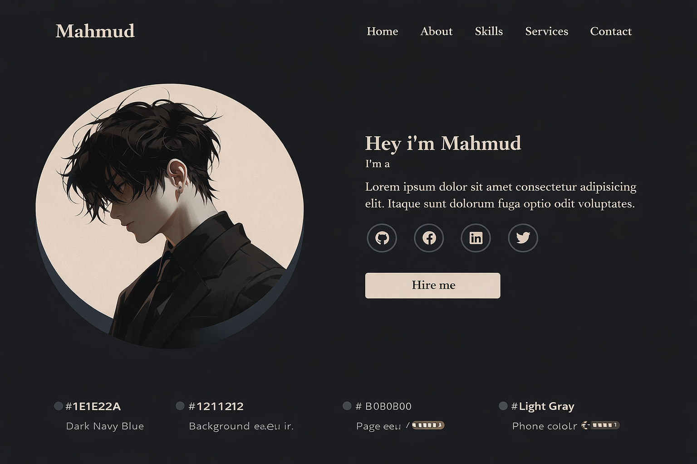

# Mahmud - Professional Portfolio Website



A modern, responsive portfolio website showcasing my skills as a Frontend Developer, UI/UX Designer, and Digital Creator. Built with HTML, CSS, and JavaScript, featuring smooth animations, interactive elements, and a professional design.

## 🌐 Live Demo
**[View Live Site](https://mahmud-portfolio.vercel.app)** | **[GitHub Repository](https://github.com/Mahmud1Available/portfolio)**

## 📸 Screenshots

| Desktop View                                                                    | Mobile View                                                                   | Tablet View                                                                   |
| ------------------------------------------------------------------------------- | ----------------------------------------------------------------------------- | ----------------------------------------------------------------------------- |
|  |  |  |

## ✨ Features

- **Modern & Responsive Design**: Fully responsive across all devices (mobile, tablet, desktop)
- **Smooth Animations**: AOS library for scroll animations and custom counter animations
- **Interactive Elements**:
  - Animated skill counters that trigger on scroll
  - Typewriter effect for hero section
  - Active navigation highlighting
  - Mobile hamburger menu
- **Professional Sections**:
  - Hero/Introduction
  - About Me
  - Skills with percentage indicators
  - Services offered
  - Contact form with validation
- **Performance Optimized**: Fast loading times and smooth performance
- **SEO Ready**: Proper meta tags and semantic HTML

## 🛠️ Technologies Used

- **Frontend**: HTML5, CSS3, JavaScript (ES6+)
- **Animations**: [AOS Library](https://michalsnik.github.io/aos/)
- **Icons**: Font Awesome 6
- **Fonts**: Google Fonts (Inter)
- **Form Handling**: Formspree
- **Hosting**: Vercel (recommended)


## 📁 Project Structure

```
portfolio/
├── index.html # Main HTML file
├── style.css # Main stylesheet
├── scripts.js # JavaScript functionality
├── screenshot.png # Main screenshot (1920x1080)
├── img/ # Images and assets
│ ├── hero 1.png
│ ├── hero 3.png
│ └── hero 4.png
├── Fontawesome/ # Font Awesome icons
│ └── css/
│ └── all.css
└── README.md # This file
```

## 🚀 Getting Started

### Prerequisites
- A modern web browser (Chrome, Firefox, Safari, Edge)
- Code editor (VS Code recommended)
- Git installed

### Local Development

1. **Clone the repository**
   ```bash
   git clone https://github.com/Mahmud1Available/portfolio.git
   cd portfolio
   ```

2. **Open in browser**
   - Simply open `index.html` in your browser
   - Or use a local server:
     ```bash
     # Python 3
     python -m http.server 8000
     
     # Node.js with http-server
     npx http-server
     ```

3. **Make changes**
   - Edit `index.html` for content
   - Edit `style.css` for styling
   - Edit `scripts.js` for functionality

## 📦 Deployment

### Deploy to Vercel (Recommended)

1. **Push to GitHub**
   ```bash
   git add .
   git commit -m "Initial portfolio commit"
   git push origin main
   ```

2. **Deploy to Vercel**
   - Go to [vercel.com](https://vercel.com)
   - Sign in with GitHub
   - Click "New Project"
   - Import your repository
   - Click "Deploy"

   Your site will be live at: `https://your-project-name.vercel.app`

### Deploy to GitHub Pages

1. **Go to repository settings**
2. **Navigate to Pages section**
3. **Select branch** (usually `main` or `gh-pages`)
4. **Select folder** (`/root`)
5. **Click Save**

Your site will be live at: `https://username.github.io/repository-name`

## 🔧 Customization

### Change Content
1. **Personal Information**: Update name, contact details in `index.html`
2. **Skills**: Modify percentages and titles in skills section
3. **Services**: Update service offerings and descriptions
4. **Images**: Replace images in `img/` folder with your own

### Change Styling
- **Colors**: Modify CSS variables in `style.css`
- **Fonts**: Update Google Fonts link in `index.html`
- **Animations**: Adjust AOS settings in JavaScript

### Add Sections
1. Add new `<section>` in `index.html`
2. Style in `style.css`
3. Add navigation link if needed
4. Update JavaScript for active navigation

## 📝 License

This project is licensed under the MIT License - see the [LICENSE](LICENSE) file for details.

## 🤝 Contributing

Contributions are welcome! Please feel free to submit a Pull Request.

1. Fork the project
2. Create your feature branch (`git checkout -b feature/AmazingFeature`)
3. Commit your changes (`git commit -m 'Add some AmazingFeature'`)
4. Push to the branch (`git push origin feature/AmazingFeature`)
5. Open a Pull Request

## 📞 Contact

Mahmud - [adebisimahmud04@gmail.com](mailto:adebisimahmud04@gmail.com)

Project Link: [https://github.com/Mahmud1Available/portfolio](https://github.com/Mahmud1Available/portfolio)

## 🙏 Acknowledgments

- [AOS Library](https://michalsnik.github.io/aos/) for scroll animations
- [Font Awesome](https://fontawesome.com/) for icons
- [Google Fonts](https://fonts.google.com/) for Inter font
- [Vercel](https://vercel.com) for hosting

## 📊 Project Status


---

⭐ **If you find this project useful, please give it a star!** ⭐

## 🔗 Quick Links

- [View Live Demo](https://mahmud-portfolio.vercel.app)
- [Report Bug](https://github.com/Mahmud1Available/portfolio/issues)
- [Request Feature](https://github.com/Mahmud1Available/portfolio/issues)
- [View Source Code](https://github.com/Mahmud1Available/portfolio)

## 📈 Deployment History

| Date       | Version | Changes                  | Status |
| ---------- | ------- | ------------------------ | ------ |
| 2024-01-01 | v1.0.0  | Initial Release          | ✅ Live |
| 2024-01-05 | v1.1.0  | Added skill animations   | ✅ Live |
| 2024-01-10 | v1.2.0  | Mobile menu improvements | ✅ Live |

## 🎯 Features Roadmap

- [x] Responsive design
- [x] Skill animations
- [x] Contact form
- [ ] Dark/Light mode toggle
- [ ] Project gallery
- [ ] Blog section
- [ ] Multi-language support

---

**Built with ❤️ by Mahmud**